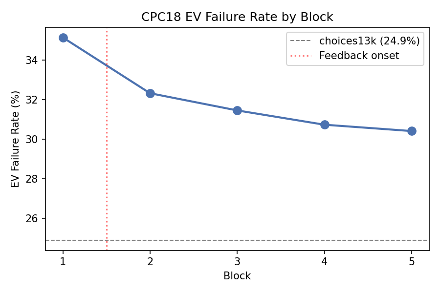
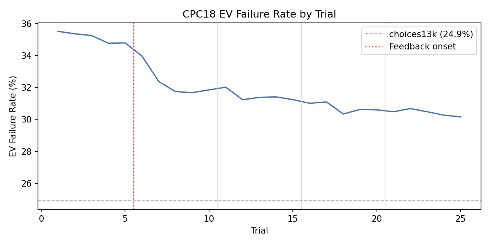
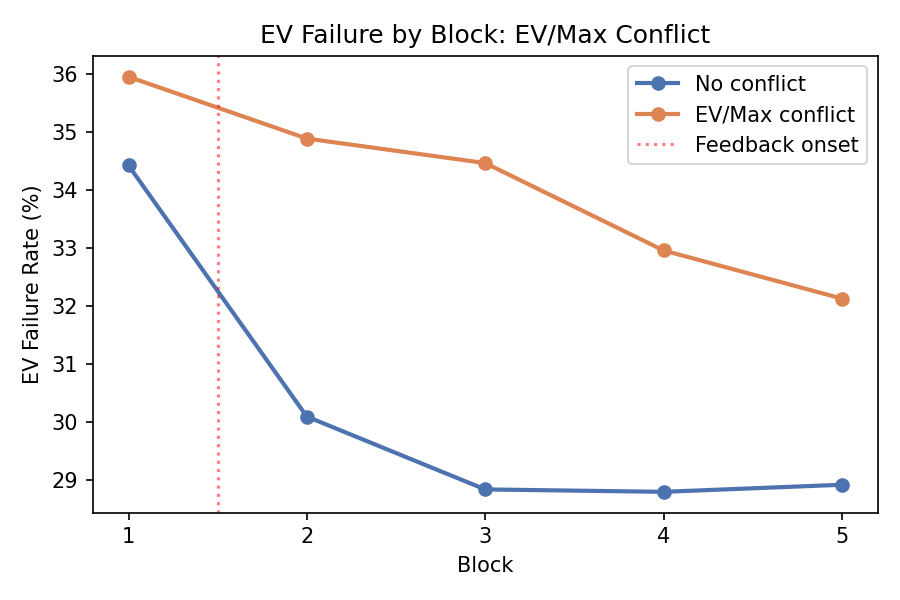

# CPC18 Learning Dynamics

Generated: 2026-05-05 13:00 UTC

## Overview

Analyzes whether EV failure in CPC18 changes across blocks and trials.
Excluded 14 GameIDs with ev_diff=0 (EV ties).

**Critical confound**: Block 1 is always no-feedback; blocks 2–5 always have feedback.
Block and feedback effects cannot be separated.

## Overall EV-Consistency by Block

| Block | Feedback | EV Failure Rate |
|-------|----------|----------------|
| 1 | No | 35.1% |
| 2 | Yes | 32.3% |
| 3 | Yes | 31.5% |
| 4 | Yes | 30.7% |
| 5 | Yes | 30.4% |

Block 1 → Block 2 drop: 2.8 percentage points
Block 2 → Block 5 change: 1.9 percentage points

## Overall EV-Consistency by Trial

- Block 1 (trials 1–5) range: 34.8% – 35.5%
- Blocks 2–5 (trials 6–25) range: 30.2% – 34.0%

## Stratified Analysis

### Ambiguity

| Ambiguity | Block 1 | Block 2 | Block 3 | Block 4 | Block 5 | Shift (B5−B1) |
|---|---|---|---|---|---|---|
| False | 34.2% | 31.7% | 31.2% | 30.6% | 30.3% | -3.9pp |
| True | 40.7% | 35.8% | 33.1% | 31.6% | 31.2% | -9.5pp |

### EV/Max Conflict

| EV/Max Conflict | Block 1 | Block 2 | Block 3 | Block 4 | Block 5 | Shift (B5−B1) |
|---|---|---|---|---|---|---|
| False | 34.4% | 30.1% | 28.8% | 28.8% | 28.9% | -5.5pp |
| True | 36.0% | 34.9% | 34.5% | 33.0% | 32.1% | -3.8pp |

### Safe Option A

| Safe Option A | Block 1 | Block 2 | Block 3 | Block 4 | Block 5 | Shift (B5−B1) |
|---|---|---|---|---|---|---|
| False | 40.4% | 38.0% | 36.7% | 35.9% | 35.7% | -4.7pp |
| True | 31.0% | 27.9% | 27.4% | 26.7% | 26.3% | -4.8pp |

### Reconstruction Method

| Reconstruction Method | Block 1 | Block 2 | Block 3 | Block 4 | Block 5 | Shift (B5−B1) |
|---|---|---|---|---|---|---|
| empirical | 38.5% | 35.6% | 34.4% | 33.4% | 32.6% | -5.9pp |
| exact | 32.0% | 29.2% | 28.7% | 28.3% | 28.4% | -3.6pp |

### N Outcomes B

| Group | Block 1 | Block 2 | Block 3 | Block 4 | Block 5 | Shift (B5−B1) |
|---|---|---|---|---|---|---|
| 1-2 | 32.7% | 30.1% | 29.6% | 29.2% | 29.4% | -3.3pp |
| 3-4 | 34.3% | 33.1% | 33.4% | 32.5% | 31.5% | -2.8pp |
| 5-6 | 39.8% | 34.8% | 32.7% | 31.2% | 30.0% | -9.8pp |
| 7+ | 41.4% | 37.6% | 35.4% | 34.1% | 33.3% | -8.1pp |

## Per-GameID Learning Shifts

- Mean learning_shift: 0.0479
- Median learning_shift: 0.0474
- Improved (shift > 0): 172
- Worsened (shift < 0): 84
- Unchanged: 0

### EV/Max Conflict × Learning

- Conflict: mean shift = 0.0375, early failure = 36.1%, late failure = 32.3%
- No conflict: mean shift = 0.0565, early failure = 34.6%, late failure = 29.0%

### Ambiguity × Learning

- Ambiguous: mean shift = 0.0995, early failure = 41.6%, late failure = 31.7%
- Non-ambiguous: mean shift = 0.0392, early failure = 34.2%, late failure = 30.3%

### Top 20 Largest Positive Learning Shifts

| game_id | early_fail | late_fail | shift | ev_max_conflict | ambiguity |
|---------|-----------|----------|-------|-----------------|-----------|
| 239 | 73.8% | 18.0% | 0.558 | False | True |
| 42 | 60.5% | 19.8% | 0.407 | True | True |
| 194 | 44.8% | 11.0% | 0.338 | True | True |
| 263 | 86.0% | 53.0% | 0.330 | True | True |
| 198 | 67.7% | 35.0% | 0.327 | True | True |
| 64 | 64.8% | 32.5% | 0.323 | True | True |
| 154 | 65.7% | 33.5% | 0.322 | True | True |
| 88 | 68.0% | 37.0% | 0.310 | False | True |
| 82 | 45.2% | 18.0% | 0.272 | False | True |
| 197 | 62.8% | 36.0% | 0.268 | False | False |
| 259 | 64.2% | 37.5% | 0.267 | True | True |
| 231 | 74.3% | 48.2% | 0.262 | False | False |
| 93 | 55.5% | 29.8% | 0.258 | True | True |
| 112 | 51.0% | 26.0% | 0.250 | True | False |
| 207 | 66.8% | 42.2% | 0.247 | False | False |
| 264 | 60.3% | 36.2% | 0.242 | True | False |
| 253 | 51.7% | 28.0% | 0.237 | True | False |
| 133 | 29.5% | 6.2% | 0.233 | False | False |
| 1 | 57.8% | 35.0% | 0.227 | False | False |
| 262 | 62.8% | 40.7% | 0.222 | True | False |

### Top 20 Largest Negative Learning Shifts (Anti-Learning)

| game_id | early_fail | late_fail | shift | ev_max_conflict | ambiguity |
|---------|-----------|----------|-------|-----------------|-----------|
| 227 | 16.2% | 57.3% | -0.412 | True | True |
| 204 | 36.0% | 63.5% | -0.275 | False | True |
| 196 | 15.7% | 42.7% | -0.270 | True | True |
| 142 | 29.8% | 53.8% | -0.240 | True | False |
| 237 | 11.7% | 32.8% | -0.212 | True | True |
| 151 | 32.8% | 53.5% | -0.207 | True | False |
| 102 | 38.5% | 59.0% | -0.205 | True | True |
| 127 | 26.2% | 44.0% | -0.177 | True | True |
| 178 | 18.2% | 35.2% | -0.170 | True | False |
| 39 | 49.9% | 66.4% | -0.165 | True | False |
| 95 | 27.7% | 43.2% | -0.155 | False | False |
| 210 | 35.5% | 51.0% | -0.155 | False | False |
| 52 | 63.7% | 78.3% | -0.146 | False | False |
| 172 | 18.8% | 33.3% | -0.145 | True | False |
| 75 | 35.2% | 49.5% | -0.142 | True | False |
| 111 | 24.5% | 38.7% | -0.142 | True | False |
| 50 | 43.7% | 57.3% | -0.136 | True | False |
| 234 | 30.5% | 44.0% | -0.135 | False | True |
| 175 | 31.3% | 44.2% | -0.128 | True | False |
| 65 | 32.5% | 45.0% | -0.125 | False | False |

## Comparison to choices13k

| Condition | EV Failure Rate |
|-----------|----------------|
| choices13k (all) | 24.9% |
| CPC18 block 1 (no feedback) | 35.1% |
| CPC18 blocks 2–5 (feedback) | 31.2% |
| CPC18 block 5 only | 30.4% |
| CPC18 overall | 32.0% |

Block 1 failure (35.1%) is closer to choices13k (24.9%) than the CPC18 overall (32.0%).
This suggests that feedback/experience in later blocks partially explains the lower CPC18 failure rate.

## Limitations

- Feedback and block are perfectly confounded (block 1 = no feedback always).
- Cannot separate experience (repeated trials) from information (feedback) effects.
- CPC18 is experience-based repeated choice; choices13k may be description-based.
- Empirical reconstruction for 122/270 GameIDs.
- This is exploratory, not causal proof.
- Individual differences are averaged out.

## Assumptions

1. EV-consistency is a meaningful measure of rational choice.
2. Aggregating across participants within GameID × block is appropriate.
3. The feedback × block confound is acknowledged but not resolvable.
4. Trial order within a block reflects temporal sequence.
